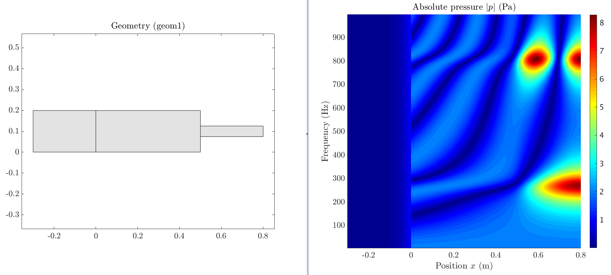

# COMSOL-to-MATLAB-Livelink--Getting-Started-Guide
Repository containing a beginner's guide to COMSOL's Livelink for MATLAB

### This guide is intended for people with a minimum background knowledge of both MATLAB® and COMSOL® Multiphysics software. It aims to provide a basic understanding on how to ‘link’ both software in order to be able to manipulate COMSOL® through a MATLAB® interface. Such inter-software communication can become extremely useful when designing complex systems which involve both numerical computation through MATLAB® and numerical solving through COMSOL® , e.g., systems that require computational steps between simulation iterations and/or ones whose complex geometry can be parametrically built.

<ins>Directory content:</ins>

* **_Getting Started Guide MATLAB-COMSOL-Livelink.pdf_** $\rightarrow$ Guide presenting step-by-step information on how to install, code and export COMSOL-driven numerical data into MATLAB.
* **_LiveLink for MATLAB® User’s Guide.pdf_** $\rightarrow$ COMSOL Guide presenting exhaustive information on MATLAB LiveLink functions.
* **Tutorial** $\rightarrow$ COMSOL and MATLAB files presenting a hands-on tutorial introduced in the Getting Started Guide.

## Software required for this guide

Both MATLAB® and COMSOL® Multiphysics software are required to use the files contained in the **Turorial** folder. These are licensed software. Licences and/or demo versions can be found on the respective commercial websites. 

* MATLAB website $\rightarrow$ [https://uk.mathworks.com/](https://uk.mathworks.com/)
* COMSOL website $\rightarrow$ [https://www.comsol.com/](https://www.comsol.com/)

**MATLAB®** (from Matrix Laboratory) is a proprietary programming language focused on numerical computation tasks which is mostly used by engineers and
scientists to analyse data and design systems. It comes with its own user-interface featuring plenty of tools to develop numerical systems and interpret
MATLAB® code.

**COMSOL®** is a powerful multi-physics numerical solver and simulation software. The software facilitates conventional physics-based user interfaces and coupled systems of partial differential equations (PDEs). COMSOL provides an IDE and unified workflow for electrical, mechanical, fluid, acoustics, and chemical applications.

## Inquiries

Any inquiries concerning mistakes in the documents provided can be addressed under the discussion tab of this repository.

